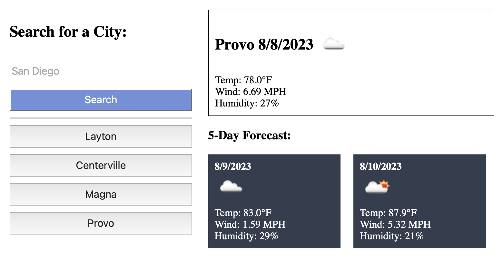

# Weather Dashboard

## Description 

This dashboard presents the current weather and a five-day forecast for whatever city the user searches. Data presented includes weather icon, temperature, wind speed, and humidity. The Open Weather Map API was used to display this information. 

## Usage

https://benthere6.github.io/weather_dashboard/

## Acceptance Criteria

GIVEN a weather dashboard with form inputs 
WHEN I search for a city 
THEN I am presented with current and future conditions for that city and that city is added to the search history 
WHEN I view current weather conditions for that city 
THEN I am presented with the city name, the date, an icon representation of weather conditions, the temperature, the humidity, and the the wind speed 
WHEN I view future weather conditions for that city 
THEN I am presented with a 5-day forecast that displays the date, an icon representation of weather conditions, the temperature, the wind speed, and the humidity 
WHEN I click on a city in the search history 
THEN I am again presented with current and future conditions for that city 

## Mockup

## Credit

This site is based on the mockup shown above, but all of the code is original.