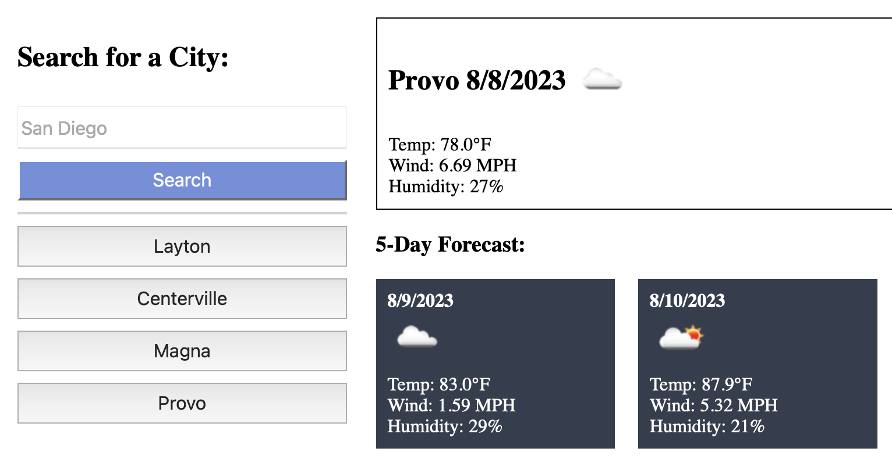

# Weather Dashboard 
  
## Description
  
This dynamic dashboard offers real-time weather updates and a comprehensive five-day forecast for any selected city. The presented data encompasses essential weather elements such as icons, temperature readings, wind speed details, and humidity levels. These insights are powered by the integration of the Open Weather Map API, ensuring accurate and up-to-date weather information for users' convenience.

## Table of Contents

* [Project Information](#project-information) 
* [Usage](#usage) 
* [Contact Information](#contact-information) 
* [Credits](#credits) 
* [License](#license)

## Project Information

This project is developed as part of a school assignment for Rutgers University. The code and documentation are created solely by BenThere6. While external contributions are not expected, this repository serves as a demonstration of my understanding of the concepts covered in the course.

## Usage

Deployed Site: https://benthere6.github.io/weather_dashboard/

Navigating the Weather Dashboard is straightforward and intuitive, providing users with timely weather insights. Here's how to make the most of its features:  1. **Initial Search:** As you open the site, you'll find a search box designated for cities. Enter the name of any city you wish to inquire about and hit "Search." The dashboard will promptly display the current weather conditions and an extended five-day forecast for your chosen location. 2. **Exploring Forecast Details:** The presented data encompasses crucial weather elements, including weather icons, temperature readings, wind speed, and humidity levels. This information equips you with a comprehensive understanding of the atmospheric conditions at a glance. 3. **Seamless City Switching:** The Weather Dashboard offers fluid transitions between cities. Feel free to conduct successive searches using the same search box. Enter new city names, and the dashboard will seamlessly update the weather details for your latest query. 4. **Historical Search Convenience:** To streamline your experience, the dashboard maintains a search history area. Previously searched cities are conveniently displayed here. Click on any of these cities, and the dashboard will instantly present the current weather and five-day forecast for that location.  Experience the ease and efficiency of the Weather Dashboard as you stay informed about weather patterns in different cities. Whether you're tracking your current location or exploring weather conditions across the globe, the dashboard ensures quick access to essential meteorological data.

## Contact Information

For any further inquiries, please feel free to reach out to me through the following channels:
* GitHub: [My GitHub Profile](https://www.github.com/BenThere6)
* Email: benjaminbirdsall@icloud.com

I am here to assist you with any questions or feedback you may have. Thank you for your interest!

## Credits

This site is inspired by the mockup image provided:    All the code used to create this site is original, although it draws inspiration from the mockup design showcased above.

## License 

[MIT License](https://opensource.org/licenses/MIT)

This code's MIT License allows you to freely use, modify, and share it for any purpose. Please include the original license and copyright notices when sharing.